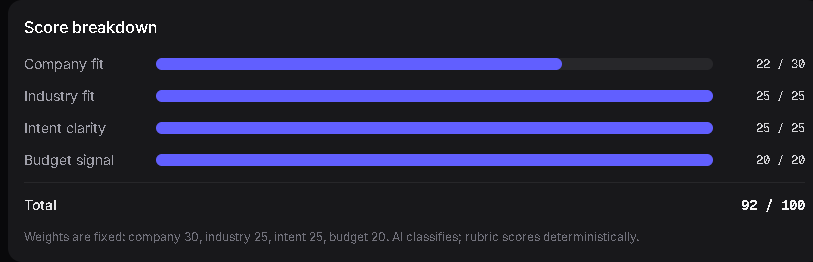

# LeadFlow

AI lead qualification pipeline — the AI classifies, the rubric scores.

Live demo: https://lead-flow-sable.vercel.app
Case study: https://lead-flow-sable.vercel.app/case-study



Sub-scores and weights rendered from the DB — no client-side recomputation.

## What it does

- Public lead form on a fictional CRM site ("Relay").
- AI classifies intent, company size, industry, and budget signal.
- A deterministic rubric scores each lead 0–100.
- Routes automatically: 70+ auto-reply, 30–69 human review, below 30 archive.
- Admin dashboard shows every score broken down by sub-score and weight.

## The design decision

AI classifies, code scores. The model returns discrete categories, never a
number. A pure TypeScript function maps those categories to points with fixed
weights. Any number the UI shows is traceable to a specific model output and
a specific rule — there is no black-box "the AI decided 78."

## Stack

| Layer    | Tech                                            | Why                                              |
|----------|-------------------------------------------------|--------------------------------------------------|
| Frontend | Next.js 15 App Router, Tailwind v4, shadcn/ui   | Server components for admin reads, RSC-ready UI  |
| LLM      | Groq gpt-oss-120b primary, Gemini fallback      | Fast extraction; one retry on failure            |
| Database | Supabase Postgres                               | RLS on, zero policies — service-role only        |
| Email    | Resend                                          | Receipt + sales notification, best-effort        |
| Deploy   | Vercel Hobby                                    | Zero-config Next.js hosting                      |

## Running locally

```bash
git clone https://github.com/darvinraj400-ux/LeadFlow.git
cd LeadFlow
npm install
cp .env.example .env.local   # then fill in every value (see below)
npm run seed                 # wipes + inserts 20 demo leads
npm run dev                  # http://localhost:3000
```

Useful commands: `npx tsc --noEmit`, `npm run build`,
`npm run seed -- --dry-run` (prints rows without inserting).

## Environment variables

| Name                          | Source                              | Required |
|-------------------------------|-------------------------------------|----------|
| NEXT_PUBLIC_SUPABASE_URL      | Supabase dashboard → Project API    | Yes      |
| NEXT_PUBLIC_SUPABASE_ANON_KEY | Supabase dashboard → Project API    | Yes      |
| SUPABASE_SERVICE_ROLE_KEY     | Supabase dashboard → Project API    | Yes      |
| GOOGLE_GENERATIVE_AI_API_KEY  | aistudio.google.com/apikey          | Yes      |
| GROQ_API_KEY                  | console.groq.com/keys               | Yes      |
| RESEND_API_KEY                | resend.com/api-keys                 | Yes      |
| SALES_EMAIL                   | Your own inbox                      | Yes      |
| ADMIN_PASSWORD                | Your choice (min 1 char, use more)  | Yes      |
| APP_URL                       | Your deploy URL, with `https://`    | Yes      |

The app fails fast at boot if any key is missing — see `lib/env.ts`.

## Database

`docs/schema.sql` is the source of truth. Paste it into the Supabase SQL
editor and run it once. RLS is enabled with intentionally zero policies:
the anon key gets nothing; all access goes through the service role on
the server.

## Deployment

Connect the repo on Vercel (Hobby is fine), add the nine env vars above,
deploy. `APP_URL` must include the protocol (`https://…`) — the metadata
layer tolerates a bare hostname, but links and sitemap need the full URL.

## Scope

v1 shipped: capture → enrichment → routing → emails → admin → case study.

Deliberately out of v1:

- Mid-flight persistence if the serverless function dies post-response
- Distributed rate limit (currently an in-memory Map, resets on cold start)
- Custom Resend domain (free-tier sender only reaches the account owner)

## License

MIT

---

Built by Darvin Raj — [GitHub](https://github.com/darvinraj400-ux)

Relay is a fictional CRM. LeadFlow is a portfolio piece.
